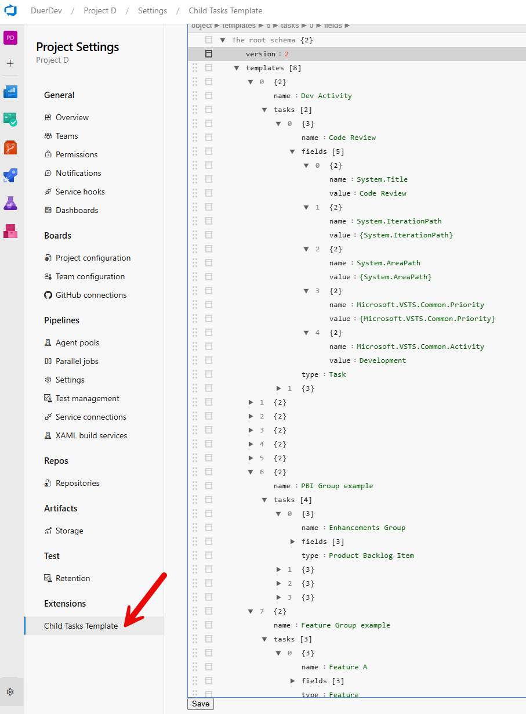
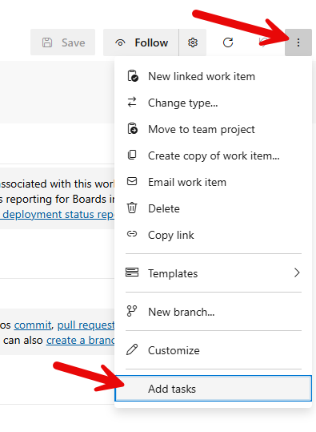
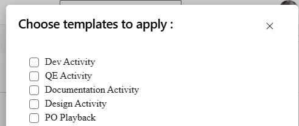

# Create linked sub tasks to your parent work item in one click

Use this extension to enable creating child tasks from an existing work items and based on a template. Automatically you will be able to generate sub work items under a parent one and with the proper links

## General information

There are two things to know to be confortable using this extension.

- How to setup a "template" of tasks

- How to create the sub linked tasks

### How to setup a template of tasks

Go in the extension setup, which is per project. As you can see below, you have a "JSON" file to determine. The easiest way is to copy our sample [Json template](https://github.com/jasonbduer/ChildTasksWITsupport/raw/main/src/settings/templateSetupSample.json) and to modify it. In the Azure DevOps Json editor, on the header bar, you can click on "Tree" or "Text". Go to the Text mode and you can copy and paste values, to add tasks to the template.


You can setup parent fields in the sub tasks. By this way, when the system will generate the sub-tasks, you will be able to use "parent task" variables, like the original title, ID, url ... In the value field, as in the sample, when you specify a field, it will be the parent's value.

### How to create the linked sub tasks

When you are on a work item, just go in the options and click on add tasks as below. The sub tasks will be automatically generated.


  

Example json format of a single section that creates 2 tasks
```json
{
  "name": "Dev Activity",
  "tasks": [
    {
      "name": "Code Review",
      "fields": [
        {
          "name": "System.Title",
          "value": "Code Review"
        },
        {
          "name": "System.IterationPath",
          "value": "{System.IterationPath}"
        },
        {
          "name": "System.AreaPath",
          "value": "{System.AreaPath}"
        },
        {
          "name": "Microsoft.VSTS.Common.Priority",
          "value": "{Microsoft.VSTS.Common.Priority}"
        },
        {
          "name": "Microsoft.VSTS.Common.Activity",
          "value": "Development"
        }
      ],
      "type": "Task"
    },
    {
      "name": "Dev Analysis and Development",
      "fields": [
        {
          "name": "System.Title",
          "value": "Dev Analysis and Development"
        },
        {
          "name": "System.IterationPath",
          "value": "{System.IterationPath}"
        },
        {
          "name": "System.AreaPath",
          "value": "{System.AreaPath}"
        },
        {
          "name": "Microsoft.VSTS.Common.Activity",
          "value": "Development"
        }
      ],
      "type": "Task"
    }
  ]
}
```
  
in this example the above shows up as Dev Activity template



and create 2 Task child work items titled
1.Code Review
2.Dev Analysis and Development

and activity types defined and inherits the parent work items iteration and area path's

Note: You can setup parent fields in the sub tasks like the area and iteration paths. By this way, when the system will generate the sub-tasks, you will be able to use "parent task" variables, like the original title, ID, url 
In the value field, as in the sample, when you specify a field, it will be the parent's value.

#### Adding fields to template:
list of available fields for each work item below you must use the systems ReferenceName for the name value ex:
Microsoft.VSTS.Common.Activity
System.AreaPath
Custom.OtherReference

### How to create the linked sub tasks

  

When you are on a work item, just go in the options and click on add tasks as below.



then select as many templates you wish to apply, please note that templates could be a set any number of work items and types so insure your select the Template of child items appropriately to its parent child hierarchy



you should then see your Child items linked to the Parent work item

  

